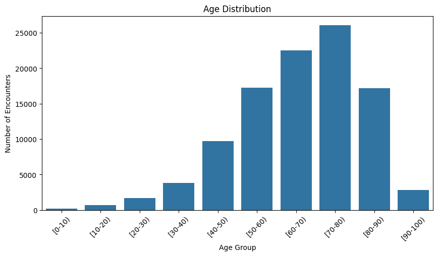
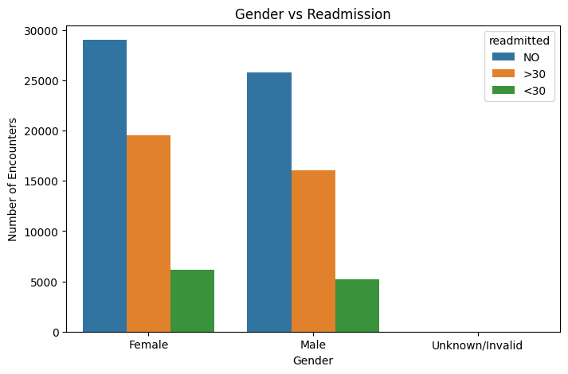
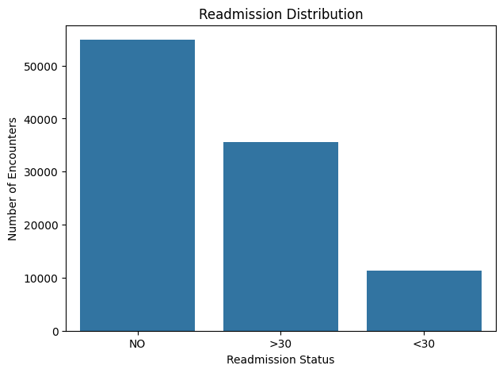
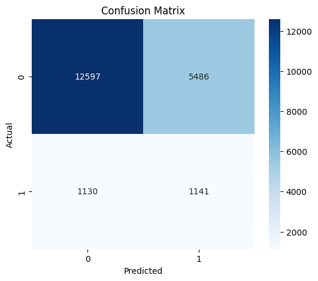
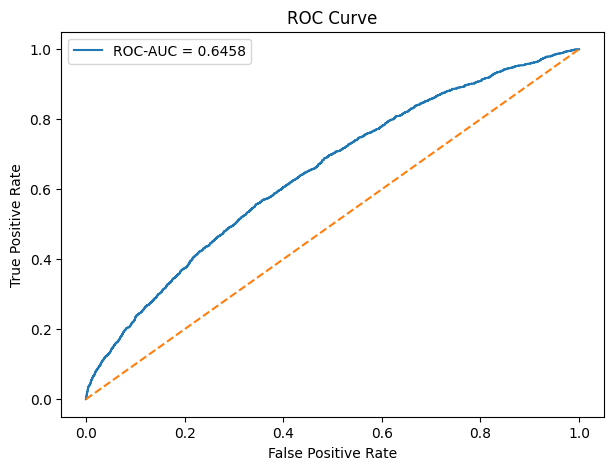

# Healthcare Data Analysis

A five-week **Healthcare Data Analyst Internship** project focused on healthcare data cleaning, exploratory data analysis, visualization, predictive modeling, and healthcare-oriented recommendations.

## Project Overview

This project analyzes the **Diabetes 130-US Hospitals for Years 1999-2008** dataset. The dataset contains **101,766 hospital encounters and 50 variables**.

The project follows a five-week internship task structure:

1. **Week 1 – Project Planning and Strategy**
2. **Week 2 – Data Cleaning and Preprocessing**
3. **Week 3 – Exploratory Data Analysis and Visualization**
4. **Week 4 – Predictive Modeling and Algorithm Selection**
5. **Week 5 – Final Evaluation and Recommendations**

## Objectives

* Understand the healthcare dataset and define the project scope.
* Identify and handle missing values, duplicates, anomalies, and inconsistent data.
* Perform exploratory data analysis to identify meaningful patterns.
* Create healthcare-related visualizations.
* Build a baseline model for predicting **30-day hospital readmission**.
* Evaluate model performance using standard classification metrics.
* Provide data-driven recommendations for healthcare operations and patient outcomes.

## Dataset

**Dataset:** Diabetes 130-US Hospitals for Years 1999-2008

**Records:** 101,766 hospital encounters
**Variables:** 50

The target variable `readmitted` contains three categories:

* `NO` – No readmission
* `>30` – Readmission after 30 days
* `<30` – Readmission within 30 days

For the predictive modeling task, the target was converted into a binary classification problem:

* `1` = Readmitted within 30 days (`<30`)
* `0` = Other readmission categories (`NO` or `>30`)

## Key Dataset Observations

* Total encounters: **101,766**
* Total variables: **50**
* Readmissions within 30 days: **11,357 (11.16%)**
* Mean time in hospital: **4.40 days**
* Median time in hospital: **4 days**
* Exact duplicate rows identified: **None**
* Several variables contain substantial missing values and therefore require documented preprocessing strategies.

## Technologies Used

* Python
* Pandas
* NumPy
* Matplotlib
* Seaborn
* Scikit-learn
* Jupyter Notebook
* Microsoft Word
* GitHub

## Project Workflow

### Week 1 – Project Planning and Strategy

The project scope, objectives, literature review, potential public data sources, timeline, milestones, risks, and contingency strategies were documented.

### Week 2 – Data Cleaning and Preprocessing

The preprocessing methodology covers:

* Missing-value identification and treatment
* Duplicate detection
* Anomaly and consistency checks
* Categorical-variable handling
* Numerical-variable preparation
* Normalization considerations
* Target-variable preparation
* Data validation

### Week 3 – Exploratory Data Analysis and Visualization

The analysis examines important variables and their relationships with hospital readmission.

The analysis includes:

* Readmission distribution
* Age distribution
* Gender and readmission analysis
* Descriptive statistics
* Correlation analysis
* Box plots and trend analysis

### Week 4 – Predictive Modeling

A baseline **Logistic Regression** model was developed to demonstrate prediction of 30-day hospital readmission.

The workflow includes:

* Stratified train-test split
* Missing-value imputation
* Categorical encoding
* Class-weighted Logistic Regression
* Model evaluation
* Confusion matrix
* ROC curve
* Accuracy
* Precision
* Recall
* F1-score
* ROC-AUC

### Week 5 – Final Evaluation and Recommendations

The final evaluation summarizes the project methodology, key findings, model performance, limitations, and recommendations related to healthcare operations and patient outcomes.

## Baseline Model Results

The educational baseline Logistic Regression model produced the following results on the test set:

| Metric    | Result |
| --------- | -----: |
| Accuracy  | 0.6715 |
| Precision | 0.1740 |
| Recall    | 0.5187 |
| F1-score  | 0.2605 |
| ROC-AUC   | 0.6463 |

These results demonstrate the predictive modeling workflow and should be interpreted in the context of class imbalance and the educational nature of the project.

## Visualizations

### Age Distribution



### Gender vs Readmission



### Readmission Distribution



### Confusion Matrix



### ROC Curve



## Repository Structure

```text
healthcare-data-analysis/
│
├── README.md
├── Healthcare_Data_Analysis.ipynb
│
├── age_distribution.png
├── gender_vs_readmission.png
├── readmission_distribution.png
├── confusion_matrix.png
├── roc_curve.png
│
├── Week_1_Project_Planning_and_Strategy.docx
├── Week_2_Data_Cleaning_and_Preprocessing.docx
├── Week_3_EDA_and_Visualization.docx
├── Week_4_Predictive_Modeling_and_Algorithm_Selection.docx
└── Week_5_Final_Evaluation_and_Recommendations.docx
```

## Important Note

This project is an **educational internship analysis**. The predictive model is a baseline demonstration and has **not been clinically validated**.

The results should not be used for clinical decision-making or patient-level medical decisions.

## Author

**Yagna Sree Kamireddy**

B.Tech Computer Science & Engineering (Data Science) – 2026
CMR University, Bangalore
